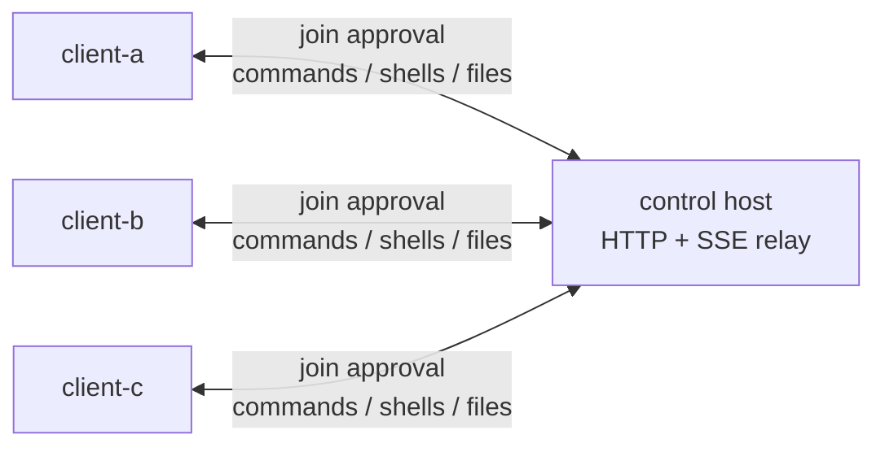

<p align="center">
  <picture>
    <source media="(prefers-color-scheme: dark)" srcset="./assets/logo-dark.png">
    <source media="(prefers-color-scheme: light)" srcset="./assets/logo-light.png">
    
  </picture>
</p>

<div align="center">by MVP Lab.</div>
## What Orbit Is

`mvp-orbit` is an HTTP-only peer command channel.

One machine runs the control `host`. Each `client` joins a named channel with only:

- a local alias
- the host URL
- the channel name

The first client in a channel is accepted automatically. Later clients create pending join requests, and any already-joined client in that channel can approve or reject them. After approval, members of the same channel can send commands, open shells, and transfer files through the host. Clients do not need direct network access to each other.



## Security Model

Channel membership is the trust boundary.

- The first client creates the channel and receives a member token.
- Later clients cannot join until an existing member approves the join request.
- A member token grants access to that channel until it expires.
- Any approved member can execute commands on any other connected member.

This is not a sandbox. Only approve clients and run commands in channels where every member is trusted.

## Commands

Public CLI commands are intentionally small:

```bash
orbit host
orbit join
orbit join-requests
orbit approve <REQUEST_ID>
orbit reject <REQUEST_ID>
orbit peers
orbit exec <peer> -- <command>
orbit sh <peer>
orbit put <peer> <local> <remote>
orbit get <peer> <remote> <local>
```

`exec`, `sh`, and `put/get` are the only peer operation modes.

## Quick Start

### 1. Start the Host

```bash
orbit host
```

The host stores channel state in SQLite and relays events over HTTP/SSE. By default it binds to `127.0.0.1:8080`; set `ORBIT_HUB_HOST=0.0.0.0` when it must listen on the network.

### 2. Join the First Client

```bash
orbit join --host http://HOST:8080 --alias client-a --channel team-a
```

`orbit join` is a foreground long-running process. After joining, it starts the client loop and keeps receiving commands, shells, file requests, and join approvals. If the process exits, that client stops receiving work.

Use `--no-start` only when you want to save config without starting the client loop:

```bash
orbit join --host http://HOST:8080 --alias client-a --channel team-a --no-start
```

### 3. Join More Clients

On another machine:

```bash
orbit join --host http://HOST:8080 --alias client-b --channel team-a
```

The new client waits for approval. Any foreground `orbit join` process already in the channel prompts directly:

```text
[orbit] new client join request
  alias: client-b
  channel: channel-...
  request: join-...
[orbit] approve this client? [y/N]:
```

If no client is running in an interactive terminal, approve manually from any existing member:

```bash
orbit join-requests
orbit approve <REQUEST_ID>
```

Use `orbit reject <REQUEST_ID>` to deny a request. Use `--no-wait` on the joining client if it should submit the request and exit immediately.

### 4. List Peers

```bash
orbit peers
```

### 5. Run One Command

```bash
orbit exec client-b -- uname -a
```

Use shell parsing when you need shell operators, variables, pipes, or `cd`:

```bash
orbit exec client-b --shell "cd /tmp && pwd && ls -la"
```

Commands run inside the target client's workspace. `--working-dir` must stay inside that workspace.

### 6. Open an Interactive Shell

```bash
orbit sh client-b
```

### 7. Transfer Files

Push a local file to a peer:

```bash
orbit put client-b ./local.txt inbox/local.txt
```

Pull a file from a peer:

```bash
orbit get client-b inbox/local.txt ./downloaded.txt
```

The default size limit is `1 MiB`. Raise it explicitly when needed:

```bash
orbit put --max-bytes 10485760 client-b ./model.bin models/model.bin
orbit get --max-bytes 10485760 client-b models/model.bin ./model.bin
```

Relative remote paths are resolved under the target client's workspace. Absolute remote paths are allowed and should be used carefully.

## Configuration

The default config file is:

```text
~/.config/mvp-orbit/config.toml
```

`orbit join` writes the host URL, local client alias, member token, and token expiry. Non-join commands read this file automatically. You can override values with CLI flags such as `--hub-url`, `--member-token`, and `--token-expires-at`.

Useful runtime environment variables:

```bash
ORBIT_CONFIG=~/.config/mvp-orbit/config.toml
ORBIT_WORKSPACE_ROOT=/path/to/workspace
ORBIT_HEARTBEAT_SEC=15
ORBIT_LOG_LEVEL=INFO      # DEBUG, INFO, WARNING, ERROR
NO_COLOR=1               # disable ANSI colors
```

Host environment variables:

```bash
ORBIT_HUB_HOST=127.0.0.1
ORBIT_HUB_PORT=8080
ORBIT_HUB_DB=./.orbit-hub/hub.sqlite3
ORBIT_OBJECT_ROOT=./.orbit-hub/objects
ORBIT_ACCESS_LOG=0        # set to 1 to enable uvicorn HTTP access logs
```

## Empty Channel Cleanup

The host automatically removes channels that have no online clients. Clients send heartbeat events while `orbit join` is running. A channel is considered empty when no client has been seen within `ORBIT_CLIENT_OFFLINE_SEC`, and it is deleted after `ORBIT_CHANNEL_EMPTY_TTL_SEC` of no activity.

Defaults:

```bash
ORBIT_CHANNEL_CLEANUP_ENABLED=1
ORBIT_CLIENT_OFFLINE_SEC=90
ORBIT_CHANNEL_EMPTY_TTL_SEC=3600
ORBIT_CHANNEL_CLEANUP_INTERVAL_SEC=60
```

Deleting a channel removes its approved members, pending join requests, stale client records, tokens, command history, shell history, and file-transfer history for that channel.

## Logging

Runtime logs use a compact structured line format:

```text
[15:52:34] INFO    client │ client.runtime     │ command.start client_id=client-a argv="python3 -V"
```

The message part uses `event key=value` so it remains easy to search and parse.

## Docker Host

The Dockerfile runs the host:

```bash
docker build -t mvp-orbit .
docker run --rm -p 8080:8080 -v orbit-data:/var/lib/orbit mvp-orbit
```

The image sets `ORBIT_HUB_HOST=0.0.0.0` and stores state under `/var/lib/orbit`.

## Network Model

Only these connections are required:

- each client can reach the control host over HTTP or HTTPS
- the host does not need to initiate connections back to clients
- clients do not need direct connectivity to each other

Realtime delivery uses SSE from host to client and HTTP POST from client to host.
