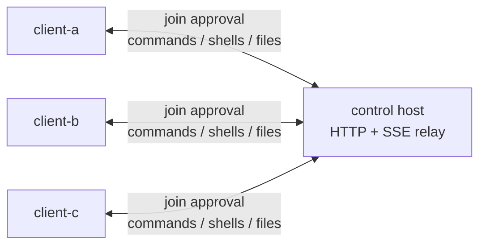

<p align="center">
  
</p>

<h1 align="center">MVP Orbit</h1>

<p align="center">by MVP Lab.</p>

<p align="center">
  <a href="https://github.com/mvp-ai-lab/mvp-orbit/releases"></a>
  
  
  
  
</p>

## What Orbit Is

`mvp-orbit` is a small HTTP-only peer command channel.

Run one control `host`, let multiple `client` machines join the same channel, approve new members from any existing client, then run commands, open shells, and move files between approved peers. Clients only need to reach the host; they do not need direct network access to each other.

## Features

- Simple join flow: `host URL` + local `alias` + `channel` name.
- First client in a channel is accepted automatically.
- Later clients require approval from any existing channel member.
- Foreground `orbit join` clients can prompt directly when a new client asks to join.
- Peer command mode: `orbit exec <peer> -- <command>` waits for output and exit status.
- Interactive shell mode: `orbit sh <peer>` opens a live shell on the target client.
- File transfer mode: `orbit put` and `orbit get`, with a default `1 MiB` limit.
- HTTP/SSE transport through the host, with no direct client-to-client networking.
- Automatic empty-channel cleanup on the host.

## Quick Start

### 1. Install or Run

From a checkout:

```bash
uv run orbit --help
```

Install the current GitHub release wheel as a tool:

```bash
uv tool install https://github.com/mvp-ai-lab/mvp-orbit/releases/download/v0.6.0/mvp_orbit-0.6.0-py3-none-any.whl
```

### 2. Start the Host

```bash
orbit host
```

By default the host listens on `127.0.0.1:8080`. To accept clients from other machines:

```bash
ORBIT_HUB_HOST=0.0.0.0 orbit host
```

### 3. Join the First Client

```bash
orbit join --host http://HOST:8080 --alias client-a --channel team-a
```

`orbit join` stays in the foreground. Once joined, this process receives commands, shells, file requests, and join approvals.

### 4. Join Another Client

On another machine:

```bash
orbit join --host http://HOST:8080 --alias client-b --channel team-a
```

The first client sees an approval prompt:

```text
[orbit] new client join request
  alias: client-b
  channel: channel-...
  request: join-...
[orbit] approve this client? [y/N]:
```

If no interactive client is available, approve manually from any existing member:

```bash
orbit join-requests
orbit approve <REQUEST_ID>
```

Reject a request with:

```bash
orbit reject <REQUEST_ID>
```

### 5. Use the Channel

List peers:

```bash
orbit peers
```

Run one command and wait for the result:

```bash
orbit exec client-b -- uname -a
orbit exec client-b --shell "cd /tmp && pwd && ls -la"
```

Open an interactive shell:

```bash
orbit sh client-b
```

Send a file to a peer:

```bash
orbit put client-b ./local.txt inbox/local.txt
```

Download a file from a peer:

```bash
orbit get client-b inbox/local.txt ./downloaded.txt
```

Raise the default `1 MiB` file limit only when needed:

```bash
orbit put --max-bytes 10485760 client-b ./model.bin models/model.bin
orbit get --max-bytes 10485760 client-b models/model.bin ./model.bin
```

## How It Works



The host stores channel state in SQLite and relays events. Each client keeps a foreground SSE connection to the host and posts command, shell, and file results back over HTTP.

## CLI Reference

The public command surface is intentionally small:

```bash
orbit host
orbit join
orbit join-requests
orbit approve <REQUEST_ID>
orbit reject <REQUEST_ID>
orbit peers
orbit exec <peer> -- <command>
orbit sh <peer>
orbit put <peer> <local> <remote>
orbit get <peer> <remote> <local>
```

Useful `join` options:

```bash
orbit join --no-start   # save config without starting the client loop
orbit join --no-wait    # submit a join request and exit immediately
```

Commands run inside the target client's workspace. `--working-dir` must stay inside that workspace. Relative remote file paths are resolved under the target client's workspace; absolute remote paths are allowed and should be used carefully.

## Security Model

Channel membership is the trust boundary.

- The first client creates the channel and receives a member token.
- Later clients cannot join until an existing member approves the join request.
- A member token grants access to that channel until it expires.
- Any approved member can execute commands on any other connected member.

This is not a sandbox. Only approve clients and run commands in channels where every member is trusted.

## Configuration

The default config file is:

```text
~/.config/mvp-orbit/config.toml
```

`orbit join` writes the host URL, local client alias, member token, and token expiry. Non-join commands read this file automatically. You can override values with CLI flags such as `--hub-url`, `--member-token`, and `--token-expires-at`.

Useful runtime environment variables:

```bash
ORBIT_CONFIG=~/.config/mvp-orbit/config.toml
ORBIT_WORKSPACE_ROOT=/path/to/workspace
ORBIT_HEARTBEAT_SEC=15
ORBIT_LOG_LEVEL=INFO      # DEBUG, INFO, WARNING, ERROR
NO_COLOR=1               # disable ANSI colors
```

Host environment variables:

```bash
ORBIT_HUB_HOST=127.0.0.1
ORBIT_HUB_PORT=8080
ORBIT_HUB_DB=./.orbit-hub/hub.sqlite3
ORBIT_OBJECT_ROOT=./.orbit-hub/objects
ORBIT_ACCESS_LOG=0        # set to 1 to enable uvicorn HTTP access logs
```

## Empty Channel Cleanup

The host automatically removes channels that have no online clients. Clients send heartbeat events while `orbit join` is running. A channel is considered empty when no client has been seen within `ORBIT_CLIENT_OFFLINE_SEC`, and it is deleted after `ORBIT_CHANNEL_EMPTY_TTL_SEC` of no activity.

Defaults:

```bash
ORBIT_CHANNEL_CLEANUP_ENABLED=1
ORBIT_CLIENT_OFFLINE_SEC=90
ORBIT_CHANNEL_EMPTY_TTL_SEC=3600
ORBIT_CHANNEL_CLEANUP_INTERVAL_SEC=60
```

Deleting a channel removes its approved members, pending join requests, stale client records, tokens, command history, shell history, and file-transfer history for that channel.

## Logging

Runtime logs use a compact structured line format:

```text
[15:52:34] INFO    client │ client.runtime     │ command.start client_id=client-a argv="python3 -V"
```

The message part uses `event key=value` so it remains easy to search and parse.

## Docker Host

The Dockerfile runs the host:

```bash
docker build -t mvp-orbit .
docker run --rm -p 8080:8080 -v orbit-data:/var/lib/orbit mvp-orbit
```

The image sets `ORBIT_HUB_HOST=0.0.0.0` and stores state under `/var/lib/orbit`.

## Network Model

Only these connections are required:

- each client can reach the control host over HTTP or HTTPS
- the host does not need to initiate connections back to clients
- clients do not need direct connectivity to each other

Realtime delivery uses SSE from host to client and HTTP POST from client to host.
