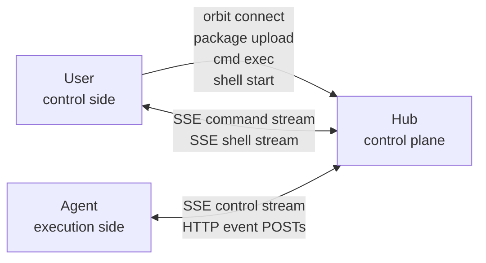

<p align="center">
  <picture>
    <source media="(prefers-color-scheme: dark)" srcset="./assets/logo-dark.png">
    <source media="(prefers-color-scheme: light)" srcset="./assets/logo-light.png">
    
  </picture>
</p>

<div align="center">by MVP Lab.</div>

## Why Orbit

`mvp-orbit` is a small HTTP-only remote execution loop for one specific workflow:

1. prepare code on one machine
2. send it to another machine
3. execute commands there
4. stream output back immediately

It is especially useful when SSH is unavailable, inconvenient, or too manual for repeated workflows.

Typical use cases:

- AI coding agents that need remote execution
- GPU / NPU / embedded debug loops
- build on one machine, run on another

## Roles

Orbit has three decoupled roles:

- `Hub`
  The control plane. It stores packages, commands, shell sessions, tokens, ownership metadata, and realtime event logs.
- `Agent`
  The execution side. An Agent keeps one long-lived SSE control stream to the Hub, executes work locally, and posts events back over HTTP.
- `User`
  The control side. A user sends commands to the Hub and targets a specific Agent.



This means the Hub can run on a dedicated server. The only required network condition is:

- the User machine can reach the Hub over HTTP or HTTPS
- the Agent machine can reach the Hub over HTTP or HTTPS

The User and Agent do not need direct connectivity to each other.

## Ownership And Auth

Every Agent belongs to exactly one `user_id`.

- The first successful Agent control-stream connection registers that `agent_id` under the current user.
- Only the same user can submit commands to that Agent, open shells on it, or read its outputs.
- Agents owned by different users are isolated and cannot be mixed.
- Package access is also isolated per user, even when two users upload identical bytes and receive the same `package_id`.

Orbit uses two token types:

- `bootstrap_token`
  A Hub-side bootstrap credential used only by `orbit connect`.
- `user_token`
  The runtime credential used by both the User-side CLI and the Agent when talking to the Hub API.

In normal operation, all Hub API calls use `user_token`.

The `bootstrap_token` is only used to mint a 7-day `user_token`:

```text
bootstrap_token -> orbit connect -> user_token -> normal Hub API traffic
```

Important notes:

- The control machine and the Agent machine do not need to share the exact same token string.
- They do need tokens that belong to the same `user_id` if that user should control that Agent.
- `orbit connect` prints an `ORBIT_AGENT_CONFIG_STRING` that can be copied to another machine.
- `orbit init node` or `orbit init agent` can consume that config-string, but `agent_id` is still chosen locally on the Agent machine.

## Runtime Model

Orbit is built around three user-facing actions:

- `package`
  Build a deterministic `.tar.gz` from a directory and upload it to the Hub.
- `cmd exec`
  Send a command to a specific Agent. `package_id` is optional.
- `shell`
  Open a persistent remote shell session with PTY semantics and reconnect support.

Key runtime semantics:

- Hub, CLI, and Agent communicate using HTTP only.
- Realtime delivery uses `SSE` down and `POST` up.
- The Agent startup directory is the base workspace unless `workspace_root` is configured.
- Commands without `package_id` run directly in the base workspace.
- Commands with `package_id` run in a package-specific subdirectory under the base workspace.
- Shell sessions start in the base workspace by default, or in the package workspace when `package_id` is provided.
- `cmd exec` waits and streams output by default. Use `--detach` to return immediately.
- `cmd exec` and `cmd output --follow` now return a local exit code derived from the remote terminal state and print a one-line summary on `stderr`.

## Quick Start

### 1. Start the Hub

On the Hub machine:

```bash
orbit init hub
orbit hub serve
```

`orbit init hub` writes Hub config and prints the bootstrap token used by `orbit connect`.

### 2. Connect as a user

On the user machine:

```bash
orbit connect
```

`orbit connect` asks for:

- the Hub URL
- a `user_id`
- the Hub `bootstrap_token`

It then writes `user_token` and `expires_at` into local config and prints:

```text
ORBIT_AGENT_CONFIG_STRING=orbit-agent-config-string-v1:...
```

### 3. Initialize and run the Agent

On the agent machine:

```bash
orbit init agent --config-string 'orbit-agent-config-string-v1:...' --agent-id agent-a
orbit agent run
```

Or use the interactive flow:

```bash
orbit init agent
```

Then paste the config-string and enter the local `agent_id`.

When the Agent connects its control stream successfully, that `agent_id` becomes owned by the current user.

## Common Flows

### Upload a package

```bash
orbit package upload --source-dir /path/to/project
```

Example response:

```json
{
  "package_id": "sha256-...",
  "size": 12345,
  "created_at": "2026-03-10T00:00:00+00:00"
}
```

### Execute in the Agent base workspace

```bash
orbit cmd exec \
  --agent-id agent-a \
  -- pwd
```

### Execute against an uploaded package

```bash
orbit cmd exec \
  --agent-id agent-a \
  --package-id <PACKAGE_ID> \
  -- python3 train.py --epochs 1
```

### Execute a compound shell command

```bash
orbit cmd exec \
  --agent-id agent-a \
  --shell \
  "cd /cache/models && HF_TOKEN=hf_xxx hf download repo --local-dir model-dir"
```

Use `--shell` when the remote command needs shell features such as:

- `cd`
- `&&`
- pipes
- redirects
- inline environment assignments

### Submit without waiting

```bash
orbit cmd exec \
  --agent-id agent-a \
  --package-id <PACKAGE_ID> \
  --detach \
  -- python3 train.py
```

Then inspect it later:

```bash
orbit cmd status --command-id <COMMAND_ID>
orbit cmd output --command-id <COMMAND_ID>
orbit cmd output --command-id <COMMAND_ID> --follow
orbit cmd cancel --command-id <COMMAND_ID>
```

Notes:

- `orbit cmd exec` streams output and exits with a mapped local exit code unless `--detach` is used.
- `orbit cmd output --follow` reattaches to a detached command, prints a terminal summary on `stderr`, and exits with a mapped local exit code.

### Open a remote shell

Base workspace:

```bash
orbit shell start --agent-id agent-a
```

Package workspace:

```bash
orbit shell start --agent-id agent-a --package-id <PACKAGE_ID>
```

Manage sessions:

```bash
orbit shell list
orbit shell list --agent-id agent-a
orbit shell attach --session-id <SESSION_ID>
orbit shell close --session-id <SESSION_ID>
```

Notes:

- `orbit shell start` attaches immediately when run in a TTY, unless `--detach` is used.
- `orbit shell start --detach` prints the new `session_id` without attaching.
- `orbit shell attach` gives you a PTY-backed remote shell.
- To close a shell explicitly, use `orbit shell close --session-id <SESSION_ID>` from any terminal with the same user token.

## Configuration

Default config path:

```text
~/.config/mvp-orbit/config.toml
```

Current config shape:

```toml
[hub]
host = "127.0.0.1"
port = 8080
db = "./.orbit-hub/hub.sqlite3"
object_root = "./.orbit-hub/objects"
url = "http://127.0.0.1:8080"

[auth]
bootstrap_token = "..."  # optional on the hub host; used by orbit connect
user_token = "..."       # used by CLI and Agent runtime
expires_at = "2026-03-18T12:34:56+00:00"

[agent]
id = "agent-a"
workspace_root = "./workspace"
```

## Legacy Notes

The following older concepts are no longer part of the product:

- agent-side polling loops
- `commands/next` and `shells/next`
- shared bundle strings such as `ORBIT_AGENT_INIT`
- `--shared-config`
- legacy run/task object workflows
