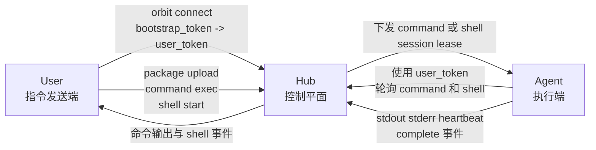

<p align="center">
  <picture>
    <source media="(prefers-color-scheme: dark)" srcset="./assets/logo-dark.png">
    <source media="(prefers-color-scheme: light)" srcset="./assets/logo-light.png">
    
  </picture>
</p>

<div align="center">by MVP Lab.</div>

## 为什么是 Orbit

`mvp-orbit` 是一个基于 HTTP 的轻量远程执行闭环，面向这样一类工作流：

1. 在一台机器上准备代码
2. 把代码发送到另一台机器
3. 在目标机器上执行命令
4. 立刻把输出回传

它尤其适合这些场景：

- 无法使用 SSH，或不想依赖 SSH
- 需要稳定重复执行的远程调试流程
- AI coding agent 的远程执行
- GPU / NPU / 嵌入式设备调试
- 一台机器构建，另一台机器运行

## 角色

Orbit 有三个彼此解耦的角色：

- `Hub`
  控制平面，负责保存 package、command、shell session、token 和归属关系。
- `Agent`
  执行端。Agent 不会被 Hub 主动推送任务，而是持续向 Hub 轮询任务，然后在自己的机器上执行。
- `User`
  指令发送端。User 通过 Hub 向指定 Agent 发送命令。



这意味着 Hub 可以部署在独立服务器上。运行时只要求：

- User 机器可以通过 HTTP 访问 Hub
- Agent 机器可以通过 HTTP 访问 Hub

User 和 Agent 之间不需要直接互通。

## 归属与认证

每个 Agent 都只属于一个 `user_id`。

- Agent 第一次成功轮询 Hub 时，会把该 `agent_id` 注册到当前用户下。
- 之后，只有同一个用户才能向该 Agent 提交命令、打开 shell 或读取输出。
- 不同用户的 Agent 彼此隔离，不能混用。
- package 的访问权限也是按用户隔离的；即使两个用户上传了完全相同的内容并得到相同的 `package_id`，权限仍然分开。

Orbit 使用两类 token：

- `bootstrap_token`
  Hub 侧引导凭证，只用于 `orbit connect`。
- `user_token`
  运行时凭证，用户侧 CLI 和 Agent 访问 Hub API 时都使用它。

正常运行时，几乎所有 Hub API 通信都只使用 `user_token`。

`bootstrap_token` 的唯一职责，是帮助某个用户换取 7 天有效的 `user_token`：

```text
bootstrap_token -> orbit connect -> user_token -> 日常 Hub API 通信
```

需要注意：

- 控制端和 Agent 端不要求持有完全相同的 token 字符串。
- 但它们必须属于同一个 `user_id`，这样控制端才能操作该用户名下的 Agent。
- `orbit init node` 会使用或更新本地配置中的 `user_token` 和 `expires_at`；这些值通常来自先前执行的 `orbit connect`。

## 运行模型

Orbit 围绕三个面向用户的动作构建：

- `package`
  把目录打成确定性的 `.tar.gz` 并上传到 Hub。
- `command exec`
  把一条命令发送给指定 Agent。`package_id` 可选。
- `shell`
  打开一个持久的远程 shell，会话支持重连。

关键运行语义：

- Agent 启动目录就是基础工作区。
- 不带 `package_id` 的命令直接在基础工作区执行。
- 带 `package_id` 的命令会在基础工作区下对应的 package 子目录执行。
- shell 默认在基础工作区启动；如果提供了 `package_id`，则在对应 package 工作区启动。
- Hub、CLI 和 Agent 之间只通过 HTTP + Bearer token 通信。

## 快速开始

### 1. 启动 Hub

在 Hub machine 上执行：

```bash
orbit init hub
orbit hub serve
```

`orbit init hub` 会写入 Hub 配置，并输出给 `orbit connect` 使用的 `bootstrap_token`。

### 2. 以用户身份 connect

在 User 机器（通常是开发机）上执行：

```bash
orbit connect --hub-url http://127.0.0.1:8080
```

`orbit connect` 会要求输入：

- Hub URL
- `user_id`
- Hub 的 `bootstrap_token`

然后把 `user_token` 和 `expires_at` 写入本地配置。

如果某个用户需要控制某台 Agent，那么 Agent 端也应该持有同一个 `user_id` 对应的有效 token。

### 3. 初始化并启动 Agent

在 Agent 机器（GPU集群节点）上执行：

```bash
orbit init node --agent-id agent-a
orbit agent run
```

`orbit init node` 会配置：

- Hub URL
- `user_token`
- `expires_at`
- `agent_id`
- 工作区与轮询参数

当 Agent 成功开始轮询后，该 `agent_id` 就会归属到当前用户。

## 常用流程

### 上传文件包

```bash
orbit package upload --source-dir /path/to/project
```

示例返回：

```json
{
  "package_id": "sha256-...",
  "size": 12345,
  "created_at": "2026-03-10T00:00:00+00:00"
}
```

### 在 Agent 基础工作区执行命令

```bash
orbit command exec \
  --agent-id agent-a \
  -- pwd
```

### 在上传的 package 上执行命令

```bash
orbit command exec \
  --agent-id agent-a \
  --package-id <PACKAGE_ID> \
  -- python3 train.py --epochs 1
```

### 执行复合 shell 命令

```bash
orbit command exec \
  --agent-id agent-a \
  --shell \
  "cd /cache/models && HF_TOKEN=hf_xxx hf download repo --local-dir model-dir"
```

当远端命令需要以下 shell 能力时，请使用 `--shell`：

- `cd`
- `&&`
- 管道
- 重定向
- 内联环境变量

### 只提交，不等待

```bash
orbit command exec \
  --agent-id agent-a \
  --package-id <PACKAGE_ID> \
  --detach \
  -- python3 train.py
```

之后再查看：

```bash
orbit command status --command-id <COMMAND_ID>
orbit command output --command-id <COMMAND_ID>
orbit command output --command-id <COMMAND_ID> --follow
orbit command cancel --command-id <COMMAND_ID>
```

### 打开远程 shell

基础工作区：

```bash
orbit shell start --agent-id agent-a
```

package 工作区：

```bash
orbit shell start --agent-id agent-a --package-id <PACKAGE_ID>
```

管理会话：

```bash
orbit shell list
orbit shell list --agent-id agent-a
orbit shell attach --session-id <SESSION_ID>
orbit shell close --session-id <SESSION_ID>
```

本地 attach 时：

- `/detach` 只断开本地连接，保留远端 shell
- `/close` 关闭远端 shell

## 配置

默认配置文件路径：

```text
~/.config/mvp-orbit/config.toml
```

当前配置结构：

```toml
[hub]
host = "127.0.0.1"
port = 8080
db = "./.orbit-hub/hub.sqlite3"
object_root = "./.orbit-hub/objects"
url = "http://127.0.0.1:8080"

[auth]
bootstrap_token = "..."  # 给 orbit connect 使用
user_token = "..."       # 给 CLI 和 Agent 运行时使用
expires_at = "2026-03-18T12:34:56+00:00"

[agent]
id = "agent-a"
workspace_root = "./workspace"
poll_interval_sec = 5.0
heartbeat_interval_sec = 5.0
```
