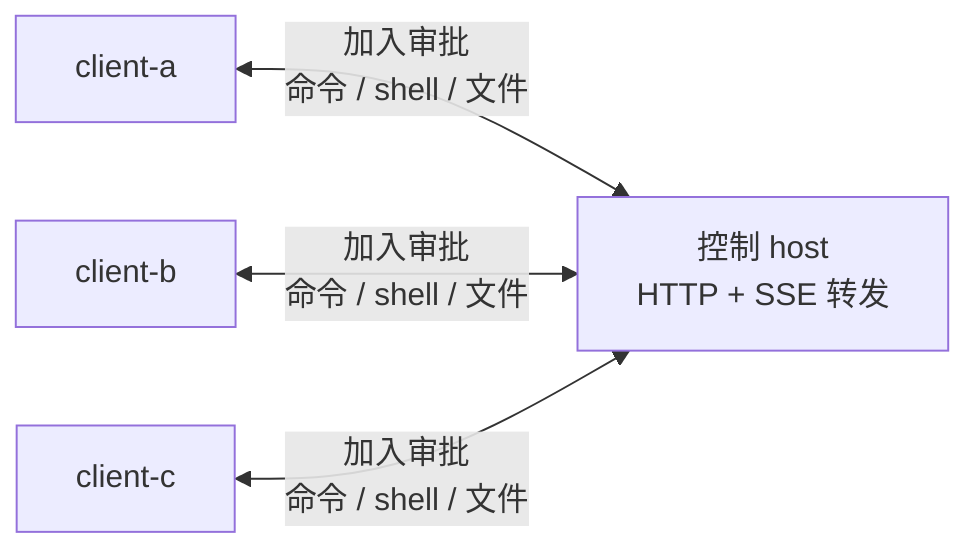

<p align="center">
  
</p>

<h1 align="center">MVP Orbit</h1>

<p align="center">by MVP Lab.</p>

<p align="center">
  <a href="https://github.com/mvp-ai-lab/mvp-orbit/releases"></a>
  
  
  
  
</p>

## Orbit 是什么

`mvp-orbit` 是一个轻量的纯 HTTP peer 命令 channel。

运行一个控制 `host`，让多台 `client` 加入同一个 channel，新成员由任意已加入 client 审批。审批通过后，同一 channel 内的成员可以互相执行命令、打开 shell、传输文件。client 只需要能访问 host，不需要彼此直连。

## 核心功能

- 简单加入：只需要 `host 地址`、本机 `alias` 和 `channel` 名称。
- 某个 channel 的第一台 client 自动通过。
- 后续 client 必须由已有 channel 成员审批。
- 前台运行的 `orbit join` 可以在新 client 申请加入时直接弹出审批 prompt。
- 单命令模式：`orbit exec <peer> -- <command>` 发送命令并等待输出和退出码。
- 交互式 shell 模式：`orbit sh <peer>` 打开目标 client 上的实时 shell。
- 文件传输模式：`orbit put` 和 `orbit get`，默认大小限制 `1 MiB`。
- 通过 host 使用 HTTP/SSE 转发，不需要 client 之间直接联网。
- host 自动清理空 channel。

## 快速开始

### 1. 安装或直接运行

从源码目录运行：

```bash
uv run orbit --help
```

把当前 GitHub Release 的 wheel 安装成工具：

```bash
uv tool install https://github.com/mvp-ai-lab/mvp-orbit/releases/download/v0.6.0/mvp_orbit-0.6.0-py3-none-any.whl
```

### 2. 启动 Host

```bash
orbit host
```

默认监听 `127.0.0.1:8080`。如果需要允许其他机器连接：

```bash
ORBIT_HUB_HOST=0.0.0.0 orbit host
```

### 3. 第一台 Client 加入

```bash
orbit join --host http://HOST:8080 --alias client-a --channel team-a
```

`orbit join` 会在前台持续运行。加入成功后，这个进程负责接收命令、shell、文件请求和加入审批。

### 4. 第二台 Client 加入

另一台机器执行：

```bash
orbit join --host http://HOST:8080 --alias client-b --channel team-a
```

第一台 client 会看到审批 prompt：

```text
[orbit] new client join request
  alias: client-b
  channel: channel-...
  request: join-...
[orbit] approve this client? [y/N]:
```

如果没有交互式 client 在线，可以从任意已有成员手动审批：

```bash
orbit join-requests
orbit approve <REQUEST_ID>
```

拒绝请求：

```bash
orbit reject <REQUEST_ID>
```

### 5. 开始使用 Channel

查看 peers：

```bash
orbit peers
```

执行单条命令并等待结果：

```bash
orbit exec client-b -- uname -a
orbit exec client-b --shell "cd /tmp && pwd && ls -la"
```

打开交互式 shell：

```bash
orbit sh client-b
```

发送文件到对端：

```bash
orbit put client-b ./local.txt inbox/local.txt
```

从对端下载文件：

```bash
orbit get client-b inbox/local.txt ./downloaded.txt
```

默认文件大小限制是 `1 MiB`。只有需要时才显式提高：

```bash
orbit put --max-bytes 10485760 client-b ./model.bin models/model.bin
orbit get --max-bytes 10485760 client-b models/model.bin ./model.bin
```

## 工作方式



host 使用 SQLite 保存 channel 状态并负责事件转发。每个 client 通过前台 SSE 连接接收事件，并通过 HTTP POST 把命令、shell、文件结果返回给 host。

## CLI 参考

公开命令面刻意保持很小：

```bash
orbit host
orbit join
orbit join-requests
orbit approve <REQUEST_ID>
orbit reject <REQUEST_ID>
orbit peers
orbit exec <peer> -- <command>
orbit sh <peer>
orbit put <peer> <local> <remote>
orbit get <peer> <remote> <local>
```

常用 `join` 选项：

```bash
orbit join --no-start   # 只保存配置，不启动 client loop
orbit join --no-wait    # 提交加入申请后立即退出
```

命令会在目标 client 的 workspace 内执行。`--working-dir` 必须保持在该 workspace 内。相对 remote path 会解析到目标 client 的 workspace 下；绝对 remote path 也允许，但应谨慎使用。

## 安全模型

Channel 成员关系就是信任边界。

- 第一个 client 创建 channel，并获得 member token。
- 后续 client 必须被已有成员审批后才能加入。
- member token 在过期前可访问该 channel。
- 任意已批准成员都可以对任意在线成员执行命令。

这不是沙箱。只应该批准可信 client，也只应该在可信 channel 里执行命令。

## 配置

默认配置文件是：

```text
~/.config/mvp-orbit/config.toml
```

`orbit join` 会写入 host URL、本机 client 别名、member token 和 token 过期时间。非 join 命令会自动读取这个配置。也可以用 `--hub-url`、`--member-token`、`--token-expires-at` 覆盖。

常用运行环境变量：

```bash
ORBIT_CONFIG=~/.config/mvp-orbit/config.toml
ORBIT_WORKSPACE_ROOT=/path/to/workspace
ORBIT_HEARTBEAT_SEC=15
ORBIT_LOG_LEVEL=INFO      # DEBUG, INFO, WARNING, ERROR
NO_COLOR=1               # 禁用 ANSI 颜色
```

Host 环境变量：

```bash
ORBIT_HUB_HOST=127.0.0.1
ORBIT_HUB_PORT=8080
ORBIT_HUB_DB=./.orbit-hub/hub.sqlite3
ORBIT_OBJECT_ROOT=./.orbit-hub/objects
ORBIT_ACCESS_LOG=0        # 设为 1 可打开 uvicorn HTTP access log
```

## 空 Channel 自动清理

host 会自动删除没有在线 client 的 channel。`orbit join` 运行时会发送 heartbeat。若某个 channel 在 `ORBIT_CLIENT_OFFLINE_SEC` 内没有任何 client 更新在线状态，并且超过 `ORBIT_CHANNEL_EMPTY_TTL_SEC` 没有活动，就会被删除。

默认值：

```bash
ORBIT_CHANNEL_CLEANUP_ENABLED=1
ORBIT_CLIENT_OFFLINE_SEC=90
ORBIT_CHANNEL_EMPTY_TTL_SEC=3600
ORBIT_CHANNEL_CLEANUP_INTERVAL_SEC=60
```

删除 channel 会同时清理该 channel 的已批准成员、待审批请求、过期 client 记录、token、命令历史、shell 历史和文件传输历史。

## 日志

运行时日志使用紧凑的结构化单行格式：

```text
[15:52:34] INFO    client │ client.runtime     │ command.start client_id=client-a argv="python3 -V"
```

消息部分使用 `event key=value`，方便搜索和解析。

## Docker Host

Dockerfile 运行的是 host：

```bash
docker build -t mvp-orbit .
docker run --rm -p 8080:8080 -v orbit-data:/var/lib/orbit mvp-orbit
```

镜像默认设置 `ORBIT_HUB_HOST=0.0.0.0`，并把状态保存在 `/var/lib/orbit`。

## 网络模型

只需要满足：

- 每台 client 可以通过 HTTP 或 HTTPS 访问控制 host
- host 不需要主动连接 client
- client 之间不需要直接互通

实时链路使用 `host -> client` 的 SSE，以及 `client -> host` 的 HTTP POST。
