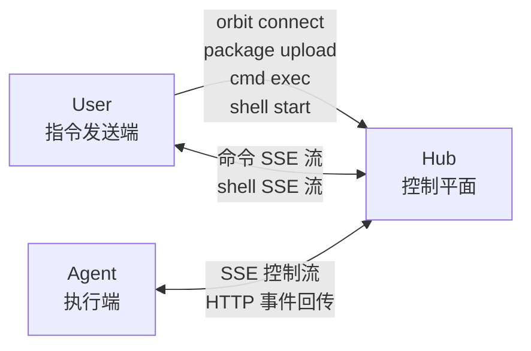

<p align="center">
  <picture>
    <source media="(prefers-color-scheme: dark)" srcset="./assets/logo-dark.png">
    <source media="(prefers-color-scheme: light)" srcset="./assets/logo-light.png">
    
  </picture>
</p>

<div align="center">by MVP Lab.</div>

## 为什么是 Orbit

`mvp-orbit` 是一个纯 HTTP 的轻量远程执行闭环，面向这样一类工作流：

1. 在一台机器上准备代码
2. 把代码发送到另一台机器
3. 在目标机器上执行命令
4. 立刻把输出实时回传

它尤其适合这些场景：

- 无法使用 SSH，或不想依赖 SSH
- 需要稳定重复执行的远程调试流程
- AI coding agent 的远程执行
- GPU / NPU / 嵌入式设备调试
- 一台机器构建，另一台机器运行

## 角色

Orbit 有三个彼此解耦的角色：

- `Hub`
  控制平面，负责保存 package、command、shell session、token、归属关系和实时事件日志。
- `Agent`
  执行端。Agent 会和 Hub 建立一个长期 SSE 控制流，在本地执行命令，然后通过普通 HTTP POST 回传事件。
- `User`
  指令发送端。User 通过 Hub 向指定 Agent 发送命令。



这意味着 Hub 可以部署在独立服务器上。运行时只要求：

- User 机器可以通过 HTTP 或 HTTPS 访问 Hub
- Agent 机器可以通过 HTTP 或 HTTPS 访问 Hub

User 和 Agent 之间不需要直接互通。

## 归属与认证

每个 Agent 都只属于一个 `user_id`。

- Agent 第一次成功建立控制流时，会把该 `agent_id` 注册到当前用户下。
- 之后，只有同一个用户才能向该 Agent 提交命令、打开 shell 或读取输出。
- 不同用户的 Agent 彼此隔离，不能混用。
- package 的访问权限也是按用户隔离的；即使两个用户上传了完全相同的内容并得到相同的 `package_id`，权限仍然分开。

Orbit 使用两类 token：

- `bootstrap_token`
  Hub 侧引导凭证，只用于 `orbit connect`。
- `user_token`
  运行时凭证，用户侧 CLI 和 Agent 访问 Hub API 时都使用它。

正常运行时，几乎所有 Hub API 通信都只使用 `user_token`。

`bootstrap_token` 的唯一职责，是帮助某个用户换取 7 天有效的 `user_token`：

```text
bootstrap_token -> orbit connect -> user_token -> 日常 Hub API 通信
```

需要注意：

- 控制端和 Agent 端不要求持有完全相同的 token 字符串。
- 但它们必须属于同一个 `user_id`，这样控制端才能操作该用户名下的 Agent。
- `orbit connect` 会打印一个 `ORBIT_AGENT_CONFIG_STRING`，可以复制到另一台机器上使用。
- `orbit init node` / `orbit init agent` 可以消费这个 config-string，但 `agent_id` 仍然在 Agent 机器本地输入。

## 运行模型

Orbit 围绕三个面向用户的动作构建：

- `package`
  把目录打成确定性的 `.tar.gz` 并上传到 Hub。
- `cmd exec`
  把一条命令发送给指定 Agent。`package_id` 可选。
- `shell`
  打开一个持久的远程 shell，会话具有 PTY 语义并支持重连。

关键运行语义：

- Hub、CLI 和 Agent 之间只通过 HTTP 通信。
- 实时链路采用 `SSE 下行 + POST 上行`。
- Agent 启动目录就是基础工作区，除非配置了 `workspace_root`。
- 不带 `package_id` 的命令直接在基础工作区执行。
- 带 `package_id` 的命令会在基础工作区下对应的 package 子目录执行。
- shell 默认在基础工作区启动；如果提供了 `package_id`，则在对应 package 工作区启动。
- `cmd exec` 默认会等待并流式打印输出；只有加 `--detach` 才会立即返回。
- `cmd exec` 和 `cmd output --follow` 会根据远端终态返回本地退出码，并在 `stderr` 打一行摘要。

## 快速开始

### 1. 启动 Hub

在 Hub 机器上执行：

```bash
orbit init hub
orbit hub serve
```

`orbit init hub` 会写入 Hub 配置，并输出给 `orbit connect` 使用的 `bootstrap_token`。

### 2. 以用户身份 connect

在 User 机器上执行：

```bash
orbit connect
```

`orbit connect` 会要求输入：

- Hub URL
- `user_id`
- Hub 的 `bootstrap_token`

然后把 `user_token` 和 `expires_at` 写入本地配置，并打印：

```text
ORBIT_AGENT_CONFIG_STRING=orbit-agent-config-string-v1:...
```

### 3. 初始化并启动 Agent

在 Agent 机器上执行：

```bash
orbit init agent --config-string 'orbit-agent-config-string-v1:...' --agent-id agent-a
orbit agent run
```

也可以走交互式流程：

```bash
orbit init agent
```

然后粘贴 config-string，再在本地输入 `agent_id`。

当 Agent 成功建立控制流后，该 `agent_id` 就会归属到当前用户。

## 常用流程

### 上传文件包

```bash
orbit package upload --source-dir /path/to/project
```

示例返回：

```json
{
  "package_id": "sha256-...",
  "size": 12345,
  "created_at": "2026-03-10T00:00:00+00:00"
}
```

### 在 Agent 基础工作区执行命令

```bash
orbit cmd exec \
  --agent-id agent-a \
  -- pwd
```

### 在上传的 package 上执行命令

```bash
orbit cmd exec \
  --agent-id agent-a \
  --package-id <PACKAGE_ID> \
  -- python3 train.py --epochs 1
```

### 执行复合 shell 命令

```bash
orbit cmd exec \
  --agent-id agent-a \
  --shell \
  "cd /cache/models && HF_TOKEN=hf_xxx hf download repo --local-dir model-dir"
```

当远端命令需要以下 shell 能力时，请使用 `--shell`：

- `cd`
- `&&`
- 管道
- 重定向
- 内联环境变量

### 只提交，不等待

```bash
orbit cmd exec \
  --agent-id agent-a \
  --package-id <PACKAGE_ID> \
  --detach \
  -- python3 train.py
```

之后再查看：

```bash
orbit cmd status --command-id <COMMAND_ID>
orbit cmd output --command-id <COMMAND_ID>
orbit cmd output --command-id <COMMAND_ID> --follow
orbit cmd cancel --command-id <COMMAND_ID>
```

说明：

- `orbit cmd exec` 默认会流式输出并等待结束，除非使用 `--detach`。
- `orbit cmd output --follow` 用于重新 attach 到 detached command，同时会在结束时打印摘要并返回映射后的本地退出码。

### 打开远程 shell

基础工作区：

```bash
orbit shell start --agent-id agent-a
```

package 工作区：

```bash
orbit shell start --agent-id agent-a --package-id <PACKAGE_ID>
```

管理会话：

```bash
orbit shell list
orbit shell list --agent-id agent-a
orbit shell attach --session-id <SESSION_ID>
orbit shell close --session-id <SESSION_ID>
```

说明：

- `orbit shell start` 在本地是 TTY 时会立即 attach；加 `--detach` 才只打印 `session_id`。
- `orbit shell attach` 提供 PTY 语义的远程 shell。
- 如果要显式关闭远端 shell，请使用 `orbit shell close --session-id <SESSION_ID>`。

## 配置

默认配置文件路径：

```text
~/.config/mvp-orbit/config.toml
```

当前配置结构：

```toml
[hub]
host = "127.0.0.1"
port = 8080
db = "./.orbit-hub/hub.sqlite3"
object_root = "./.orbit-hub/objects"
url = "http://127.0.0.1:8080"

[auth]
bootstrap_token = "..."  # 给 orbit connect 使用
user_token = "..."       # 给 CLI 和 Agent 运行时使用
expires_at = "2026-03-18T12:34:56+00:00"

[agent]
id = "agent-a"
workspace_root = "./workspace"
```

## 旧概念说明

下面这些旧概念已经不再属于当前版本：

- Agent 轮询式取任务
- `commands/next` 和 `shells/next`
- `ORBIT_AGENT_INIT` 之类的 bundle 字符串
- `--shared-config`
- 旧的 run/task 对象工作流
