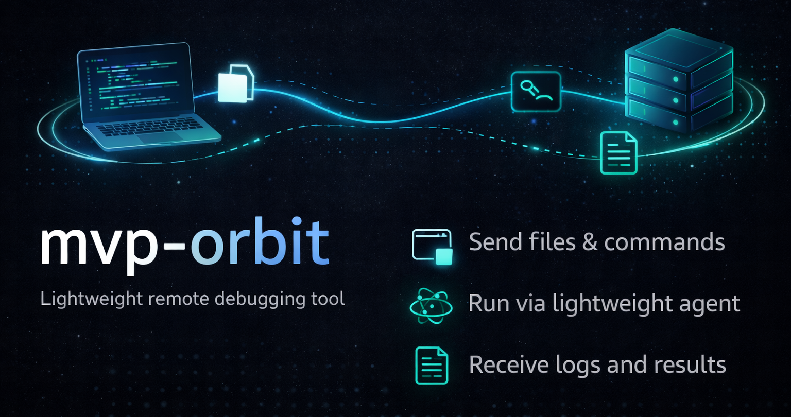

<p align="center">
  <picture>
    <source media="(prefers-color-scheme: dark)" srcset="./assets/logo-dark.png">
    <source media="(prefers-color-scheme: light)" srcset="./assets/logo-light.png">
    
  </picture>
</p>

<p align="center">
  <p align="center">
    by MVP Lab.
  </p>
</p>

`mvp-orbit` 是一个轻量级远程调试工具，用来把文件和命令发送到另一台机器执行，并把结果再取回来。

它适合这类场景：

- 在一台机器上开发
- 把文件包和命令发送到另一台机器
- 通过轻量 Agent 远程执行
- 拉回日志、退出码和最终状态
- 根据结果继续迭代

它也非常适合 AI coding 工具这类自动化场景：

- 自动提交远程测试任务
- 自动收集日志
- 自动进入重试和 debug 循环
- 把 coding agent 的执行请求转交给目标机器

典型例子：

- 在 GPU 机器上开发，在 NPU 机器上调试
- 在构建机准备文件，在测试机执行
- 不想搭完整 CI 平台，只想快速做远程调试任务
- 让 AI coding 工具自动上传文件包、远程执行命令，并根据结果继续修改代码

## 功能概览

当前版本提供这些能力：

- 从目录打包文件
- 基于 Git 选择文件，并遵循 `.gitignore`
- 以结构化 JSON 上传命令
- 由 `file_package + command` 组成 task
- 通过 Hub 把任务投递给指定 `agent_id`
- Agent 以 pull 模式拉取并执行任务
- 采集 stdout/stderr
- 回传 exit code 和最终状态
- 用 GitHub 存储文件包、命令、task、日志和结果
- 提供 Hub 和 Agent 的交互式初始化

从实际使用上看，它很适合作为 AI 辅助开发的轻量执行闭环：

1. coding 工具在本地修改文件
2. 上传文件包和命令
3. 在目标机器执行 task
4. 回收日志和退出状态
5. 决定下一轮修改

## 核心对象

运行时围绕三个对象构建：

- `file_package`：从源目录打成的 `.tar.gz` 文件包
- `command`：结构化执行数据，包含 `argv`、`env_patch`、`timeout_sec`、`working_dir`
- `task`：把 `package_id + command_id` 绑定成一次可运行任务

这样使用流程会比较清晰：

1. 上传文件包
2. 上传命令
3. 创建 task
4. 提交到目标 agent
5. 查看日志和结果

## 运行方式

- Hub 负责保存运行元数据和对象 ID
- Agent 轮询 Hub 获取任务
- 真实任务内容存放在 GitHub Release Assets
- 开发机和 Agent 机都使用同一个 `orbit` CLI
- 初始化之后默认使用同一份 TOML 配置

## 当前后端

当前版本只实现了 GitHub 存储后端。

- GitHub 操作通过 `gh` CLI 完成
- 机器上需要先执行过 `gh auth login`
- 对象统一存放在独立 relay 仓库的 GitHub Release Assets 中

存储层通过 `ObjectStoreBackend` 抽象，后续扩展到 S3、Hugging Face 等后端时，不需要改执行链路。

## 快速开始

默认情况下，`orbit` 会从这里读取配置：

```text
~/.config/mvp-orbit/config.toml
```

你可以通过 `--config /path/to/config.toml` 或 `ORBIT_CONFIG=/path/to/config.toml` 覆盖它，但正常使用不应该再需要显式传配置路径。

### 必需配置

- Python 3.11+
- GitHub CLI (`gh`)
- 一个私有 GitHub relay 仓库
- Hub/开发机与 Agent 机器上都已经完成 `gh auth login`
- 如需代理，可设置 `HTTPS_PROXY`

#### 1) 交互式初始化 Hub 配置

在 Hub / 开发机上执行：

```bash
orbit init hub
```

该命令会交互式询问：

- GitHub relay 仓库配置
- Hub 监听 host / port / sqlite 路径
- Hub 对外 URL

并自动生成并写入：

- `api_token`
- `ticket_secret`
- task 签名密钥对

然后启动 Hub：

```bash
orbit hub serve
```

#### 2) 交互式初始化 Agent 配置

在 Agent 机器上执行：

```bash
orbit init agent --agent-id agent-a
```

该命令会交互式询问：

- `agent_id`
- Hub URL
- Hub `api_token`
- 共享的 `ticket_secret`
- task 公钥
- GitHub relay 仓库配置

然后启动 Agent：

```bash
orbit agent run
```

完成这一步后，Hub 和 Agent 后续都可以直接使用默认配置路径运行。

### 使用

更推荐的日常使用方式是：让 Codex 这类 coding AI 工具自动调用这些 CLI，而不是人工逐条输入。

一个典型闭环是：

1. coding AI 在本地修改文件
2. 自动把当前工作目录上传成文件包
3. 自动上传要远程执行的命令
4. 自动创建 task
5. 自动提交到目标 agent
6. 自动读取日志和结果
7. 根据结果决定下一轮修改

#### 1) 上传文件包

`orbit package upload` 具备 Git 感知能力。如果源目录位于 Git 仓库中，它会使用：

- `git ls-files --cached --others --exclude-standard`

这意味着 `.gitignore` 会生效。选中的文件会被打成确定性的 `.tar.gz`，所以相同内容会得到相同的 `package_id`。

```bash
orbit package upload \
  --source-dir /path/to/project
```

输出：

- `package_id`
- `file_count`

#### 2) 上传 command 对象

先创建 `command.json`：

```json
{
  "argv": ["python3", "train.py", "--epochs", "1"],
  "env_patch": {
    "MODE": "debug"
  },
  "timeout_sec": 3600,
  "working_dir": "."
}
```

上传：

```bash
orbit command upload \
  --file command.json
```

输出：

- `command_id`

#### 3) 上传签名后的 task 对象

```bash
orbit task upload \
  --package-id <PACKAGE_ID> \
  --command-id <COMMAND_ID> \
  --created-by "$USER"
```

`orbit task upload` 默认会从配置文件里读取私钥；只有你想临时覆盖时才需要显式传 `--private-key`。
生成出来的 task 本身已经包含 `package_id` 和 `command_id`。

输出：

- `task_id`
- `package_id`
- `command_id`

#### 4) 提交运行任务

```bash
orbit run submit \
  --agent-id agent-a \
  --task-id <TASK_ID>
```

输出：

- `run_id`
- `run_ticket`

#### 5) 查询状态、日志和结果

```bash
orbit run status --run-id <RUN_ID>

orbit run logs \
  --run-id <RUN_ID>

orbit run result \
  --run-id <RUN_ID>
```
